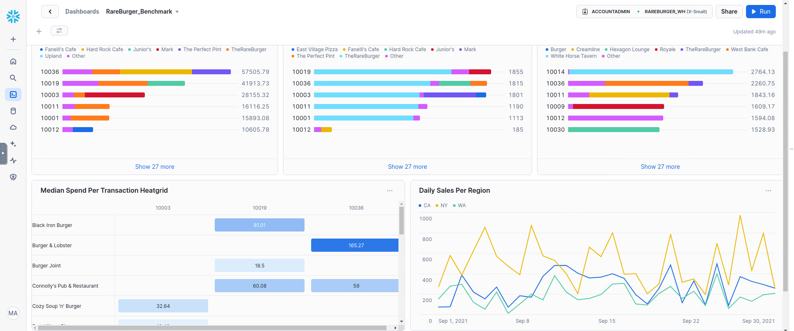

# Snowflake Tutorial
This repository showcase my basic understanding of using Snowflake. What I learn from this tutorial:
1. How to get data from Snowflake Marketplace
2. How to create a virtual warehouse
3. How to create databases and tables
4. Write SQL Query to analyse data
5. Creata a Snowflake dashboard

From the files you can review all the queries I wrote to create table and also for analysis.

## Snowflake Dashboard

